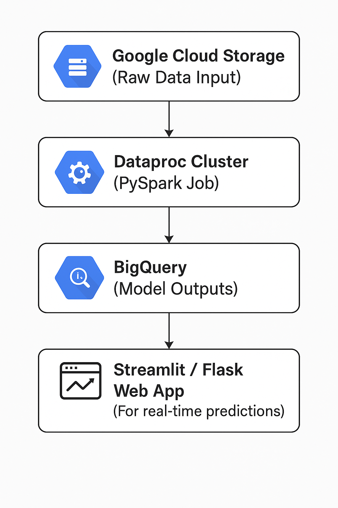

# 📰 Classifying News Articles with Spark NLP

Built a scalable **text classification model** using **Spark NLP**, **PySpark ML**, and **John Snow Labs' pre-trained models**. The project processes and classifies **2,225 BBC News articles** into **five categories**: `business`, `entertainment`, `politics`, `sport`, and `tech`.

---

## 📌 Project Highlights

* 📄 **Dataset**: 2,225 labeled BBC news articles  
* 🧠 **Goal**: Accurately classify each article into one of the five categories  
* ⚙️ **Tech Stack**: PySpark, Spark NLP, Spark MLlib, Pandas, John Snow Labs NLP models, Google Cloud Platform (GCP)  
* 🛠 **Pipeline Includes**:
  * Data ingestion and cleaning
  * Text preprocessing (tokenization, lemmatization, stopwords removal, etc.)
  * Feature extraction (TF-IDF, CountVectorizer)
  * Model training using Spark ML algorithms
  * Evaluation using accuracy, F1-score, and precision/recall

---

## 🧪 Tools & Libraries Used

* **Apache Spark & PySpark**: Distributed data processing  
* **Spark NLP (John Snow Labs)**: High-performance NLP on Spark  
* **Spark MLlib**: Scalable machine learning pipelines  
* **Google Cloud Platform (GCP)**: Cloud-native architecture suggestion  
* **Jupyter Notebook**: Interactive development environment

---

## 🌐 Suggested GCP Architecture

This architecture shows how the solution could scale in a real-world environment using GCP services:



> Save the image as `assets/gcp_architecture.png` inside a folder named `assets` in your GitHub repository.

---

## 📁 Repository Structure

📦 Classifying-News-Articles-with-Spark-NLP
┣ 📓 Spark NLP & ML for Text Classification.ipynb
┣ 📜 README.md
┗ 📁 assets
┗ 🖼️ gcp_architecture.png

yaml
Copy
Edit

---

## 📈 Results

The trained models were able to achieve strong classification accuracy on the BBC News dataset. Spark NLP's integration with Spark ML pipelines enabled fast and efficient processing of text at scale.

---

## 🚀 Getting Started

### 1. Clone the Repo

``` 
git clone https://github.com/Bhaskar-scientist/Classifying-News-Articles-with-Spark-NLP.git
cd Classifying-News-Articles-with-Spark-NLP
```
2. Install Dependencies

pip install pyspark spark-nlp pandas

4. Launch Jupyter Notebook

jupyter notebook

Then open and run:
📓 Spark NLP & ML for Text Classification.ipynb

🔍 Future Improvements
Deploy the classifier using Streamlit or Flask

Add a REST API for real-time predictions

Experiment with more advanced models (e.g., BERT with Spark NLP)

Visualize word distributions and model confusion matrices

Integrate with Google Cloud Storage & Vertex AI

👨‍💻 Author
Bhaskar Reddy
Data Scientist | NLP & ML Enthusiast
🌐 

⭐️ If you found this useful...
Feel free to star the repository and share it with others working in NLP or PySpark!
